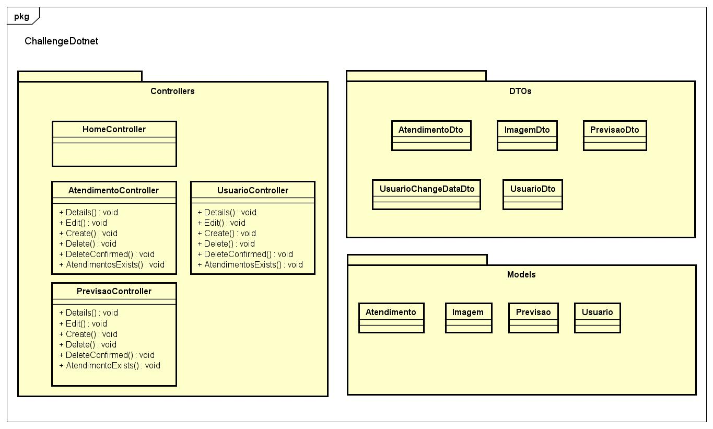

# ChallengeDotnet - Parrot Tech

Este projeto .NET MVC tem o objetivo de realizar o agendamento de atendimentos odontológicos e criar a base para nossa solução de previsão de imagens em modelos de IA que será implementada durante o decorrer das sprints visando a diminuição do sinistro dentário dos clientes da OdontoPrev.

## Começando

Essas instruções permitirão que você obtenha uma cópia do projeto em operação na sua máquina local para fins de desenvolvimento e teste.

### 📋 Pré-requisitos

- .NET SDK 8.

### 🔧 Instruções

**Git Clone -**
 Execute esse comando em seu terminal:
```
git clone https://github.com/your-user/challenge-dotnet-sprint1.git
```
Abra o projeto e execute o comando no CLI do Nuget para atualizar o banco de dados: 
```
update-database
```
Caso necessário, crie também uma migration no projeto: 
```
add-migration nomeDePreferencia
```

## 🛠️ Imagens dos diagramas

<p align="center">
  
  <br>Diagrama de Classe
</p>

## ✒️ Autores

* **Caio Eduardo Nascimento Martins - RM554025**
* **Julia Mariano Barsotti Ferreira - RM552713**
* **Leonardo Gaspar Saheb - RM553383**
